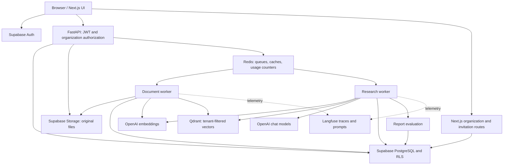
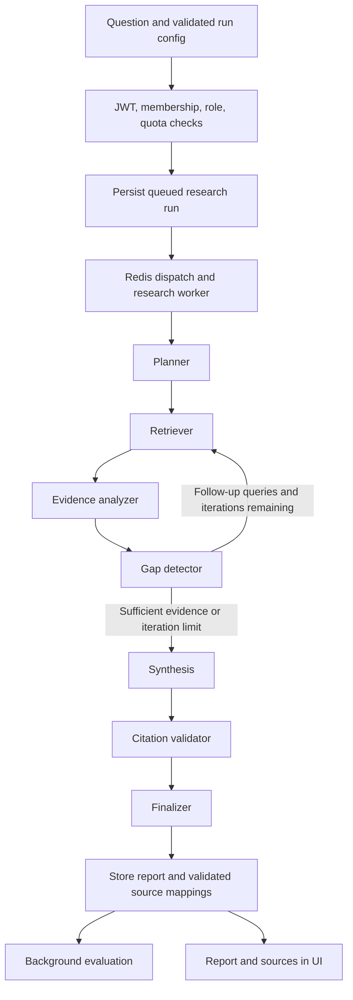

# AgentFlow AI

**An organization-scoped AI research and knowledge intelligence platform.**
Upload documents, turn them into a searchable knowledge base, ask research
questions, and review generated reports with source citations and quality metrics.
The repository is named **AgenticFlow-AI**; the application uses **AgentFlow AI**.

> **Current implementation:** authentication and organizations, document ingestion,
> semantic retrieval, a bounded multi-step research pipeline, report persistence,
> evaluations, usage guardrails, and Langfuse integration. This is no longer a
> foundation-only shell. Some tool/MCP/RAG modules remain scaffolding; see
> [implementation boundaries](#16-implementation-boundaries-and-limitations).

## Contents

- [Architecture and technology](#1-architecture-and-technology)
- [Repository layout](#2-repository-layout)
- [Prerequisites](#3-prerequisites) · [Installation](#4-installation)
- [Configuration](#5-environment-variables) · [Local development](#6-local-development)
- [Docker](#7-docker-usage) · [Testing](#8-testing)
- [Ingestion performance](#9-ingestion-performance) · [Research performance](#10-research-performance)
- [Health](#11-health-endpoint) · [Database and roles](#12-database-migrations)
- [Features and user journey](#13-features-and-user-journey)
- [End-to-end AI pipeline](#14-end-to-end-ai-pipeline)
- [API walkthrough](#15-api-walkthrough)
- [Implementation boundaries](#16-implementation-boundaries-and-limitations)

## 1. Architecture and technology



### Tools, services, and their usage

| Component | What it does in this project | Where to look |
| --- | --- | --- |
| Next.js 16, React 19, TypeScript | App Router UI for authentication, organizations, documents, research progress, reports, evaluations, and invitations | `frontend/app/`, `frontend/components/` |
| Tailwind CSS 4, Lucide React | UI styling and icons | `frontend/app/globals.css`, `frontend/package.json` |
| FastAPI, Pydantic, Uvicorn | HTTP API, request validation, dependency-based role checks, ASGI server, generated OpenAPI docs | `backend/app/main.py`, `backend/app/api/` |
| Supabase Auth | Email/password and Google sign-in; sessions and backend bearer-token verification | `frontend/lib/`, `backend/app/core/auth.py` |
| Supabase PostgreSQL / PostgREST | Organizations, memberships, document/chunk metadata, research state, reports, citation sources, evaluations; RLS and membership invariants | `database/migrations/`, `backend/app/db/repositories/` |
| Supabase Storage | Store original uploaded files for asynchronous processing | `backend/app/services/document_storage.py` |
| pypdf / python-docx | Extract PDF text with page provenance and DOCX body paragraphs; TXT/Markdown use text parsing | `backend/app/services/document_parser.py` |
| OpenAI embeddings | Embed document chunks and search queries; default `text-embedding-3-small`, 1536 dimensions | `backend/app/services/embeddings.py` |
| Qdrant | Store chunk vectors and metadata; semantic search always filters by organization, optionally by document | `backend/app/services/vector_store.py` |
| OpenAI chat models | Plan questions, extract evidence, detect gaps, synthesize reports, optionally judge answer quality; default `gpt-4o-mini` | `backend/app/agents/llm.py`, `backend/app/agents/nodes/` |
| Research runner / optional LangGraph | Production workers use an explicit Python node runner; `build_research_graph()` also exposes a compiled LangGraph | `backend/app/agents/research_graph.py` |
| Redis | Document/research queues, query-embedding and retrieval caching, per-user usage counters and concurrent-run slots | `backend/app/services/job_queue.py`, `backend/app/cache/`, `backend/app/services/llm_guardrails.py` |
| Langfuse | Research traces, node spans, LLM generations/usage, versioned system prompts with local fallback | `backend/app/core/observability.py`, `backend/app/services/prompt_service.py` |
| Docker Compose | Run API, frontend, both workers, and Redis together | `docker-compose.yml` |
| pytest, ESLint, benchmark scripts | Backend/database checks, frontend linting, mocked performance regression checks | `backend/tests/`, `database/tests/`, `scripts/` |

**These are pipeline integrations, not an autonomous tool-calling marketplace.**
The active research workflow retrieves uploaded documents through Python services;
empty files named `web_search.py`, `calculator.py`, or `mcp/server.py` do not
represent working integrations. LangChain, `rank-bm25`, and FastMCP appear in
`requirements.txt`, but that alone does not implement hybrid search or MCP serving.

Supabase, Qdrant, and Langfuse are external services in the supplied deployment.
Compose runs **five local processes/services**: frontend, backend, document worker,
research worker, and Redis. It does not provision the external services.

## 2. Repository layout

```text
AgenticFlow-AI/
├── backend/
│   ├── app/
│   │   ├── api/             # Auth, organizations, documents, research, reports, evaluations
│   │   ├── agents/          # Research state, prompts, runner, and processing nodes
│   │   ├── core/            # Settings, authentication, RBAC, tracing, logging
│   │   ├── db/              # Supabase client and repositories
│   │   ├── services/        # Ingestion, retrieval, reports, evaluation, quotas, queues
│   │   ├── workers/         # Document and research queue consumers
│   │   ├── cache/           # Redis client
│   │   ├── llm/             # Shared LLM client helpers
│   │   ├── rag/             # Mostly scaffolding; active RAG lives in services/
│   │   ├── tools/           # Reserved tool modules (not implemented)
│   │   ├── mcp/             # Reserved MCP server (not implemented)
│   │   └── main.py          # FastAPI entrypoint
│   ├── tests/
│   ├── Dockerfile
│   └── .env.example
├── frontend/
│   ├── app/                 # Pages, auth callbacks, organization/invitation API routes
│   ├── components/
│   ├── lib/                 # API, Supabase, organization and authorization helpers
│   ├── scripts/             # Environment diagnostics
│   ├── package.json
│   └── .env.example
├── database/
│   ├── migrations/          # Ordered SQL migrations 001–018
│   ├── tests/               # PostgreSQL-backed policy and membership tests
│   └── seed.sql
├── infrastructure/          # Docker notes and Redis configuration
├── scripts/                 # Startup, health, benchmarks, Langfuse prompt seeding
├── docker-compose.yml
├── pyproject.toml
├── requirements.txt
└── .env.example
```

## 3. Prerequisites

- Python **3.10+** (3.11 and 3.12 also work: the code stays inside the 3.10
  stdlib surface, and `python -m pytest` enforces that)
- Node.js **20.9+** and npm **10+**
- Docker + Docker Compose (optional, for the containerized stack)
- Accounts / endpoints for the external services:
  - [OpenAI](https://platform.openai.com) — API key
  - [Supabase](https://supabase.com) — project URL + anon key + service-role key
  - [Qdrant](https://qdrant.tech) — cluster URL + API key
  - Redis — local or hosted instance
  - [Langfuse](https://langfuse.com) — public/secret keys + host

## 4. Installation

### 4.1 Clone & configure

```bash
git clone https://github.com/adityanaranje/AgenticFlow-AI.git
cd AgenticFlow-AI

# Backend environment
cp backend/.env.example backend/.env         # fill in real values

# Frontend environment  (NEXT_PUBLIC_SUPABASE_URL + the publishable key,
# or the legacy anon key). `npm run dev` only reads frontend/.env*, never this
# root file - and it inlines NEXT_PUBLIC_* values at start-up, so restart it
# after every edit.
cp frontend/.env.example frontend/.env.local

# (Optional) docker-compose environment
cp .env.example .env

# Validate what the frontend will actually load
(cd frontend && npm run doctor)             # add -- --copy to create the file
```

### 4.2 Backend

```bash
python3 -m venv .venv
.venv/bin/pip install -r requirements.txt
```

or:

```bash
./scripts/bootstrap.sh
```

Use `requirements.txt` for the full runtime: it includes document parsers,
`python-multipart`, and LangGraph that are not all declared in `pyproject.toml`.
Before uploading, apply migrations **001–018** as described in section 12 and
configure the hosted services. Start Redis and **both workers**, not just the API.

### 4.3 Frontend

```bash
cd frontend
npm install
```

## 5. Environment variables

| Variable                          | Used by    | Required | Notes                                     |
| --------------------------------- | ---------- | :------: | ----------------------------------------- |
| `ENVIRONMENT`                     | backend    |          | `development` (default) / `production`    |
| `API_HOST` / `API_PORT`           | backend    |          | Bind host / port (default `0.0.0.0:8000`) |
| `FRONTEND_URL`                    | backend    |          | CORS origin (default `http://localhost:3000`) |
| `OPENAI_API_KEY`                  | backend    |    🔒    | Backend-only                              |
| `OPENAI_MODEL`                    | backend    |          | Default `gpt-4o-mini`                     |
| `OPENAI_EMBEDDING_MODEL`          | backend    |          | Default `text-embedding-3-small`          |
| `SUPABASE_URL`                    | backend       |    ✅    | Project URL                               |
| `SUPABASE_ANON_KEY`               | backend       |    ✅    | Public anon key (browser-safe)            |
| `SUPABASE_SERVICE_ROLE_KEY`       | backend    |    🔒    | **Never expose to the browser**           |
| `QDRANT_URL`                      | backend    |    🔒    | Cluster URL                               |
| `QDRANT_API_KEY`                  | backend    |    🔒    | **Never expose to the browser**           |
| `QDRANT_COLLECTION`               | backend    |          | Default `agentflow_documents`             |
| `REDIS_URL`                       | backend    |          | Default `redis://localhost:6379/0`        |
| `EMBEDDING_BATCH_SIZE`            | backend    |          | Chunk texts per embedding request (default `256`) |
| `EMBEDDING_CONCURRENCY`           | backend    |          | Embedding requests in flight (default `4`) |
| `EMBEDDING_MAX_RETRIES`           | backend    |          | Retries for transient provider errors (default `3`) |
| `CHUNK_INSERT_BATCH_SIZE`         | backend    |          | Chunk rows per bulk insert (default `200`) |
| `CHUNK_INSERT_CONCURRENCY`        | backend    |          | Bulk inserts in flight (default `2`)      |
| `QDRANT_UPSERT_BATCH_SIZE`        | backend    |          | Points per Qdrant upsert request (default `128`) |
| `QDRANT_UPSERT_CONCURRENCY`       | backend    |          | Qdrant upserts in flight (default `2`)    |
| `DOCUMENT_WORKER_CONCURRENCY`     | backend    |          | Documents processed in parallel (default `4`) |
| `DOCUMENT_WORKER_POLL_SECONDS`    | backend    |          | Idle queue poll interval (default `2`)    |
| `INLINE_PROCESSING_WORKERS`       | backend    |          | Threads for the no-Redis upload fallback (default `2`) |
| `OPENAI_TIMEOUT_SECONDS`          | backend    |          | Per-request model timeout (default `60`)  |
| `RESEARCH_LLM_MAX_RETRIES`        | backend    |          | Retries for transient model errors (default `2`) |
| `RETRIEVAL_CONCURRENCY`           | backend    |          | Queries retrieved in parallel (default `4`) |
| `EVIDENCE_BATCH_CHARS`            | backend    |          | Excerpt characters per analysis call (default `60000`) |
| `EVIDENCE_CONCURRENCY`            | backend    |          | Analysis calls in flight (default `4`)    |
| `EVIDENCE_MAX_CHUNKS`             | backend    |          | Chunks analysed per run (default `48`)    |
| `RESEARCH_WORKER_CONCURRENCY`     | backend    |          | Research runs in parallel (default `2`)   |
| `RESEARCH_WORKER_POLL_SECONDS`    | backend    |          | Idle queue poll interval (default `2`)    |
| `RESEARCH_UNCLAIMED_FALLBACK_SECONDS` | backend |         | Take over a run no worker claimed (default `15`; `0` = off) |
| `REPORT_SOURCE_BATCH_SIZE`        | backend    |          | Rows per report source insert (default `100`) |
| `EMBEDDING_CACHE_TTL_SECONDS`     | backend    |          | TTL for cached query embeddings (default `3600`) |
| `LLM_USER_TOKEN_LIMIT_HOURLY`     | backend    |          | Per-user hourly token quota, `0` = unlimited (default `100000`) |
| `LLM_USER_TOKEN_LIMIT_DAILY`      | backend    |          | Per-user daily token quota, `0` = unlimited (default `200000`) |
| `LLM_USER_MAX_CONCURRENT_RUNS`    | backend    |          | Max queued/in-flight research runs per user, `0` = unlimited (default `2`) |
| `LLM_RUN_TOKEN_BUDGET`            | backend    |          | Token budget for one research run, `0` = unlimited (default `100000`) |
| `RESEARCH_RUN_SLOT_TTL_SECONDS`   | backend    |          | TTL for a run's concurrency slot (default `3600`) |
| `RESEARCH_MAX_REPORT_CHARS`       | backend    |          | Output guardrail: max stored report length (default `100000`) |
| `LANGFUSE_HOST`                   | backend    |    🔒    | Default `https://cloud.langfuse.com`      |
| `LANGFUSE_PUBLIC_KEY`             | backend    |    🔒    | Backend-only                              |
| `LANGFUSE_SECRET_KEY`             | backend    |    🔒    | **Never expose to the browser**           |
| `NEXT_PUBLIC_SUPABASE_URL`        | frontend   |    ✅    | Inlined into the browser bundle           |
| `NEXT_PUBLIC_SUPABASE_PUBLISHABLE_KEY` | frontend |   ✅    | Publishable key (`sb_publishable_...`) - preferred |
| `NEXT_PUBLIC_SUPABASE_ANON_KEY`   | frontend   |    ✅    | Legacy anon key; used when the publishable one is unset |
| `NEXT_PUBLIC_API_URL`             | frontend   |          | Backend base URL (default `http://localhost:8000`) |

**Security rules (enforced by design):** secrets are never hard-coded; the
service-role key, Langfuse secret and Qdrant key exist only server-side and
must never be given a `NEXT_PUBLIC_` prefix or referenced by frontend code.
`backend/.env.example` and `frontend/.env.example` document exactly this
split. Supabase renamed "anon" to "publishable" (and "service_role" to
"secret", `sb_secret_...`); both frontend variable names are accepted and the
legacy keys still work while enabled, but new projects only get the new ones.

### 5.1 LLM usage guardrails

Research runs make a chain of model calls, so per-user token spend is
controlled at four levels. User counters and admission slots are Redis-backed
and fail open when Redis is unavailable; the per-run token budget is tracked in
the worker. `0` disables the corresponding limit. These are usage controls, not
a guaranteed billing cap: a model call can cross the budget before the next check.

| Level            | Setting                        | Default | Enforced where        | On breach                                    |
| ---------------- | ------------------------------ | ------- | --------------------- | -------------------------------------------- |
| Per user / hour  | `LLM_USER_TOKEN_LIMIT_HOURLY`  | 100k    | dispatch (API)        | `429` with the window + used/limit details   |
| Per user / day   | `LLM_USER_TOKEN_LIMIT_DAILY`   | 200k    | dispatch (API)        | `429` as above                               |
| Per user, runs   | `LLM_USER_MAX_CONCURRENT_RUNS` | 2       | dispatch (API)        | `429` "already have N runs in progress"      |
| Per run          | `LLM_RUN_TOKEN_BUDGET`         | 100k    | worker, before each model call | run fails with a clear error; work so far is persisted |

**How much is left?** `GET /api/v1/organizations/{org}/research/quota`
(authenticated, researcher+) returns the caller's remaining budget:

```json
{
  "hourly": { "used": 12000, "limit": 100000, "remaining": 88000 },
  "daily":  { "used": 47000, "limit": 200000, "remaining": 153000 },
  "concurrent_runs": { "active": 1, "limit": 2 },
  "run_token_budget": 100000,
  "enforced": true
}
```

`remaining` is `null` for a disabled limit (`0` = unlimited) and
`enforced` is `false` when Redis is down (counters then read 0).

Tokens are the **real usage** reported by the model provider (estimated
from character counts only when a provider omits usage); cached LLM
responses consume none. Related input/output guardrails: the research
question is capped at 4000 characters, client-supplied run config is
whitelisted + clamped (`top_k ≤ 50`, `max_subquestions ≤ 10`,
`max_iterations ≤ 5`, `max_chunks ≤ 500`), and stored reports are truncated
at `RESEARCH_MAX_REPORT_CHARS` with a visible marker.

## 6. Local development

### Run the backend

```bash
./scripts/dev-backend.sh
# or manually:
cd backend
../.venv/bin/uvicorn app.main:app --reload --port 8000
```

API docs: http://localhost:8000/docs — Health: http://localhost:8000/health

### Run the workers (**required** for uploads and research)

The API only *queues* work. Uploaded documents stay `pending` and research runs
stay `queued` until a worker process consumes the Redis queue:

```bash
./scripts/dev-workers.sh
# or, manually (one terminal each, from backend/):
python -m app.workers.document_worker    # parse -> chunk -> embed -> Qdrant
python -m app.workers.research_worker    # plan -> retrieve -> analyse -> report
```

On Windows PowerShell use `.\scripts\dev-workers.ps1` (add `-NoWindow` to keep
both logs in the current console).

Symptoms of a missing worker: a research run stuck on **"Queued — waiting for a
worker"**, or an uploaded document stuck on `pending`/`processing`. If Redis is
not configured at all (no `REDIS_URL`), the API process runs the work itself in
its background pool — but the recommended setup is the two worker processes,
exactly as `docker compose` does it.

After `RESEARCH_UNCLAIMED_FALLBACK_SECONDS` (default `15`, `0` disables) the API
also takes a research run over when nothing has consumed its queue message, so a
single-process dev setup still works; the takeover is an atomic queue claim, so
a job can never run twice.

### Run the frontend

```bash
./scripts/dev-frontend.sh
# or manually:
cd frontend
npm run dev
```

Open http://localhost:3000. Sign-up / sign-in is handled by Supabase Auth:
email + password, or **Google OAuth** (Sign in with Google). The dashboard
reads the user profile and organizations seeded by `database/migrations`.

### Google OAuth: which URL goes where

Three lists have to agree, and putting the *app* URL in the *provider* list is
what produces Google's `Access blocked: This app's request is invalid`
(`redirect_uri_mismatch`). During the provider hop Google only ever talks to
your **Supabase project**, never to `localhost:3000`:

| Where | Value |
| ----- | ----- |
| Google Cloud → Auth Platform → Clients → your **Web application** client → *Authorized redirect URIs* | the Supabase project callback shown on the Google provider page — `https://<project-ref>.supabase.co/auth/callback` |
| Google Cloud → same client → *Authorized JavaScript origins* | `http://localhost:3000`, your deployed origin, and any preview origin |
| Supabase → Authentication → URL Configuration → *Site URL* | `http://localhost:3000` (dev) / the production origin |
| Supabase → Authentication → URL Configuration → *Redirect URLs* | `http://localhost:3000/auth/callback` (or `http://localhost:3000/**` in dev) plus the deployed equivalent |
| Supabase → Authentication → Sign In / Providers → Google | Client ID + Client Secret, provider enabled; scopes `openid`, `email`, `profile` |

`components/auth/GoogleButton.tsx` sends `redirectTo = <app origin>/auth/callback`
(PKCE) and `app/auth/callback/route.ts` exchanges the code — both must stay in
Supabase's *Redirect URLs* list, never in Google's.

Then verify without a browser:

```bash
cd frontend && npm run doctor     # probes /auth/v1/authorize and prints the exact
                                  # redirect_uri Supabase sends to Google
```

The dev login page also lists every value above, pre-filled from your
configured project URL and the request's own origin, under
“Google sign-in setup — exact URLs to paste”.

Notes: Google takes ~1 minute to propagate client changes; keep the OAuth
client's *Audience* set so your account can sign in (an unverified app in
“Testing” mode only lets approved test users); use the same host you visit
(`localhost` vs `127.0.0.1` are different origins — register both). Running a
local `supabase start` stack instead of the hosted one? Register
`http://127.0.0.1:54321/auth/v1/callback` with Google.

```bash
cd frontend && npm run doctor
```

Checks what Next.js will actually load — which `.env*` file each value comes
from, placeholders/quotes/UTF-16 files, an empty shell variable shadowing your
file, secret keys in browser variables, keys belonging to another project, and
(live) whether Supabase accepts the URL + key pair.

### Troubleshooting: “Missing NEXT_PUBLIC_SUPABASE_URL”

Sign-in is compiled into the browser bundle, so this family of errors is about
the *build*, not the account. In order of likelihood:

1. **Wrong file.** Values must be in `frontend/.env.local` (or
   `frontend/.env`). The repository root `.env` is only read by
   docker-compose.
2. **No restart.** `NEXT_PUBLIC_*` values are read when the dev server starts.
   Restart it (`Ctrl+C`, `npm run dev`); you should see
   `Reload env: .env.local` in the terminal. A production image needs a
   rebuild — see `frontend/Dockerfile` build args.
3. **Empty value in your shell.** `NEXT_PUBLIC_SUPABASE_URL=""` exported in the
   terminal wins over every file (Next.js stops at the first definition).
4. **Blank / placeholder line** left over from copying `.env.example`, or a
   value quoted, truncated, or with a path appended.
5. **Secret key in the frontend.** `sb_secret_...` / a `service_role` JWT in a
   `NEXT_PUBLIC_*` variable is rejected on purpose — it would be shipped to
   every browser. Use the publishable key.

The login and sign-up pages show the exact problem and the fix instead of a
generic failure, the dev server prints the same in your terminal, and
`npm run doctor` explains all five cases with commands.

## 7. Docker usage

```bash
docker compose up --build
```

| Service    | Container            | URL                            |
| ---------- | -------------------- | ------------------------------ |
| frontend   | `agentflow-frontend` | http://localhost:3000          |
| backend    | `agentflow-backend`  | http://localhost:8000/health   |
| redis      | `agentflow-redis`    | redis://localhost:6379/0       |
| document-worker | `agentflow-document-worker` | No HTTP port; consumes ingestion jobs |
| research-worker | `agentflow-research-worker` | No HTTP port; consumes research jobs |

The frontend image bakes `NEXT_PUBLIC_*` values into the browser bundle at
**build** time, so `docker compose build` fails with a `BUILD ERROR:` line when
`NEXT_PUBLIC_SUPABASE_URL` / the publishable key are missing from the root
`.env` (a green build with a broken sign-in is worse). Pass
`--build-arg REQUIRE_SUPABASE_ENV=0` for a build that intentionally carries no
credentials.

Supabase, Qdrant and Langfuse remain external — point the stack at your
hosted instances through the root `.env` file (see `.env.example`).
Image build details: `infrastructure/docker/README.md`.

## 8. Testing

### Backend (`pytest`)

```bash
# from the repository root (uses backend/tests + backend pythonpath)
pytest
# or with coverage:
.venv/bin/pip install pytest-cov
pytest --cov=app
```

The suite covers:

- `GET /health` (and `/api/v1/health`) degrade gracefully when services are
  unconfigured/unreachable and report `healthy` when every service is up
- configuration loading, env aliases (`OPENAI_MODEL`, `LANGFUSE_HOST`) and
  empty-by-default secrets
- application startup/shutdown, CORS, router registration, and OpenAPI
  exposing no secrets
- ingestion and research performance contracts (`test_ingestion_performance.py`,
  `test_research_performance.py`): batched/parallel provider calls, bounded
  prompts, progress-only mid-run writes and deterministic fallbacks
- interpreter floor (`test_python_compat.py`): no 3.11+/3.12+ only API may enter
  the shipped code, so the backend still runs on Python 3.10
- organization membership rules (`test_membership.py`): invitations, role
  changes, removals and the "always at least one owner" invariant

### Database (`pytest database/tests`)

The member-management guard rules are verified against a **real**
PostgreSQL instance, started and thrown away by the test run:

```bash
pip install pgserver "psycopg[binary]" pytest
pytest database/tests
```

The harness stubs Supabase's `auth` schema (`auth.users`, `auth.uid()`,
`auth.jwt()`), applies every migration in order, and then asserts the
database — not just the application — refuses privilege escalation:
member management (`test_member_management.py`) and the in-app invitation
requests, including directory-enumeration limits
(`test_invitation_requests.py`).

### Frontend

```bash
cd frontend
npm run lint
npm run build
```

## 9. Ingestion performance

Uploading a document is fast because it is decoupled from ingestion: the
`POST .../documents/upload` request validates the file, writes the record and
the bytes, and hands the job to the document worker (or, when Redis is not
configured, to an in-process background pool). It never runs the pipeline
itself, so response time does not grow with document size. Clients follow
progress by polling the document's `status` (`pending` → `processing` →
`completed`/`failed`).

Chunking is pure CPU and cheap (a 300-page, ~930 KB document chunks in a few
milliseconds); ingestion wall-clock time is dominated by remote calls. Each
stage is therefore batched and overlapped:

| Stage            | How it is accelerated                                                     |
| ---------------- | ------------------------------------------------------------------------- |
| Embeddings       | `EMBEDDING_BATCH_SIZE` texts per request, `EMBEDDING_CONCURRENCY` requests in flight, transient errors retried with backoff |
| Chunk rows (DB)  | `create_chunks` bulk insert, `CHUNK_INSERT_BATCH_SIZE` rows per request, `CHUNK_INSERT_CONCURRENCY` batches in flight |
| Qdrant vectors   | `QDRANT_UPSERT_BATCH_SIZE` points per request, `QDRANT_UPSERT_CONCURRENCY` requests in flight |
| DB + vector write| The two writes are independent and run at the same time; the pre-delete of previous chunks/vectors runs concurrently too |
| Multiple uploads | `DOCUMENT_WORKER_CONCURRENCY` documents are consumed in parallel (each `document-worker` container; scale replicas too) |

Measure a change without touching the real services:

```bash
python scripts/benchmark-ingestion.py --paragraphs 2000   # ~500 chunks
```

With simulated latencies (20 ms PostgREST, 300 ms embeddings, 150 ms Qdrant,
120 ms storage) the same 500-chunk document went from **13.3 s / 504 insert
requests / 8 embedding requests** to **1.2 s / 4 insert requests / 2 embedding
requests**. Tune the knobs above per deployment — raise the batch sizes to
save round trips, lower them (or the concurrency) if a provider rate-limits
you.

## 10. Research performance

A research run is a chain of *dependent* model calls (plan → retrieve →
analyse → check gaps → …→ synthesise), so latency cannot be removed by
throwing concurrency at the whole pipeline. What can be improved is the work
that is independent, and how tightly each provider call is bounded:

| Stage              | How it is accelerated                                                     |
| ------------------ | ------------------------------------------------------------------------- |
| Retrieval          | Every open query is resolved together: **one** embeddings request for all query texts, then `RETRIEVAL_CONCURRENCY` vector searches in parallel — instead of an embedding + search round trip per query |
| Evidence analysis  | Chunks are map-reduced in parallel batches of `EVIDENCE_BATCH_CHARS`, capped at the `EVIDENCE_MAX_CHUNKS` highest-scoring chunks — a prompt can no longer exceed the model's context window (which previously made the whole run fail) |
| Model calls        | `OPENAI_TIMEOUT_SECONDS` bounds each request (the SDK default is 600 s) and transient errors are retried with backoff (`RESEARCH_LLM_MAX_RETRIES`) |
| Progress writes    | Mid-run `graph_state` writes carry status/counters/queries only; the full state (chunks, evidence, report) is written once when the run ends. Cancellation checks read only the `status` column |
| Report storage     | Citation rows are inserted in bulk (`REPORT_SOURCE_BATCH_SIZE`) instead of one request per citation |
| Repeat questions   | Query embeddings are cached (`EMBEDDING_CACHE_TTL_SECONDS`, `EMBEDDING_CACHE_ENABLED`) — a query vector is a pure function of its text, so the cache can never go stale |
| Several questions  | `RESEARCH_WORKER_CONCURRENCY` runs execute in parallel per worker process |

Measure it without touching the real services:

```bash
python scripts/benchmark-research.py                          # typical run
python scripts/benchmark-research.py --subquestions 8         # 9 open queries
python scripts/benchmark-research.py --chunks-per-query 150   # large corpus
```

With simulated latencies (2.5 s per model call, 300 ms per embeddings
request, 100 ms per vector search, 20 ms per PostgREST round trip):

| Scenario                        | Before                                   | After                        |
| ------------------------------- | ---------------------------------------- | ---------------------------- |
| 4 sub-questions, 5 chunks/query  | 12.3 s · 5 embeddings · 124 KB of progress writes | 10.8 s · 1 embedding · 24 KB |
| 8 sub-questions (9 queries)      | 13.9 s · 9 embeddings · 9 searches serial | 10.9 s · 1 embedding · 9 searches parallel |
| Large corpus (287 chunks)        | run **failed** (prompt exceeded the model window) | completed, citations produced |

The remaining wall-clock time is the dependent model calls themselves; reduce
`max_iterations`, `max_subquestions` or `top_k` per run (or use a faster chat
model) to trade depth for latency.

## 11. Health endpoint

`GET /health` (also `GET /api/v1/health`) checks **OpenAI · Supabase ·
Qdrant · Redis · Langfuse** without crashing when one is unavailable:

```json
{
  "status": "healthy",
  "openai":    { "status": "up",   "detail": "Connected" },
  "supabase":  { "status": "up",   "detail": "Connected" },
  "qdrant":    { "status": "up",   "detail": "Connected" },
  "redis":     { "status": "up",   "detail": "Connected" },
  "langfuse":  { "status": "up",   "detail": "Connected" }
}
```

If any dependency is down or not configured the overall status becomes
`degraded` (HTTP 200) with per-service `down` details — the API keeps serving.

```bash
./scripts/check-health.sh          # polls backend + frontend
curl http://localhost:8000/health
```

## 12. Database migrations

SQL migrations **001–018** live in `database/migrations/` (extensions, profiles,
organizations, documents, research, reports, evaluations, RLS, storage,
indexes, member management). Apply them in a Supabase SQL editor or via
`psql`, in filename order, then run `database/seed.sql` for development data
(it intentionally inserts nothing today — users/orgs are created through the
app).

> **Upgrading an existing database?** Apply
> `015_member_management.sql` then `016_invitation_requests.sql` — see
> [`database/APPLY_MEMBER_MANAGEMENT.md`](database/APPLY_MEMBER_MANAGEMENT.md)
> for step-by-step instructions and verification queries.

### Organizations, members and roles

Roles are `owner > admin > researcher > viewer`, defined once in the
database (`organization_members_role_check`) and mirrored in
`backend/app/core/rbac.py` and `frontend/lib/organizations/types.ts`.

| Capability | viewer | researcher | admin | owner |
| ---------- | :----: | :--------: | :---: | :---: |
| Read documents, research, reports | ✅ | ✅ | ✅ | ✅ |
| Upload documents, run research | — | ✅ | ✅ | ✅ |
| Invite / remove members, change roles | — | — | ✅ | ✅ |
| Grant or revoke the `owner` role | — | — | — | ✅ |
| Delete the organization | — | — | — | ✅ |

**Adding members.** Works like a social follow request. An admin or owner
uses **Add a member** on the dashboard (or
`/organizations/{id}/members`), searches for the person, picks a role and
sends the request. The invitee sees it under **Invitations** on their own
dashboard the next time they sign in and can **Accept** or **Decline** —
no email round-trip needed.

If the address does not belong to an account yet, the inviter also gets a
one-time link (`/invitations/{token}`) to share. Invitations expire after
14 days, can be revoked, can only be accepted by the address they were
issued to, and someone who declined can be invited again.

**Finding people.** The picker is deliberately *not* a browsable user
directory. `search_invitable_users` requires the caller to be an
admin/owner of the target organization, matches only on a full exact email
address or a 3+ character name prefix, and never returns anybody's email
address to the browser. Resolving a picked user to an address happens
server-side via `resolve_invitable_email`, which repeats the admin check.

**Invariants enforced by the database** (migration 015, trigger
`organization_members_guard`) — not merely by the UI or API:

- an organization always keeps at least one owner (the last owner cannot be
  demoted, removed, or leave),
- only an owner may grant or revoke `owner` — including through an
  invitation: joining via an `owner` invite is refused unless whoever
  issued it is still an owner,
- nobody may change their own role, assign a role above their own, or act on
  a higher-ranked member,
- any member may leave voluntarily (`leave_organization`),
- membership rows are never inserted from the browser:
  `create_organization`, `accept_invitation` and `respond_to_invitation`
  are `security definer` functions that derive the user from `auth.uid()`,
- a user can only ever list or answer their *own* invitations
  (`my_pending_invitations` / `respond_to_invitation` pin every query to
  the caller's verified email, and never expose the invitation token).

The frontend helpers in `lib/organizations/rbac.ts` only shape the UI; RLS,
the guard trigger, and `backend/app/core/rbac.py` are the security boundary.

## 13. Features and user journey

1. **Sign in and create an organization.** Use email/password or configured Google
   OAuth. The dashboard lists organizations and pending invitations.
2. **Collaborate with role-based access.** Owners/admins invite members; recipients
   accept or decline in-app. Viewer, researcher, admin, and owner permissions are
   enforced beyond the UI through API authorization and database policies.
3. **Build the knowledge base.** A researcher+ uploads PDF, DOCX, TXT, or Markdown.
   Document pages show processing state and stored chunks, support document-scoped
   semantic retrieval, and allow failed documents to be reprocessed. Admin+ can
   delete documents.
4. **Ask a research question.** Submit a question about the uploaded material.
   The API queues the run and the research page polls persisted progress rather
   than holding the request open for all model calls. Researcher+ can inspect
   their remaining token quota.
5. **Follow or cancel the run.** Inspect planning/retrieval/analysis/synthesis
   progress. The run creator or an organization admin/owner can cancel it.
6. **Review the report and its evidence.** Report detail includes Markdown content,
   structured sections, confidence, and source mappings back to document chunks.
   Admin+ can delete reports.
7. **Inspect quality metrics.** Research schedules an automatic evaluation after
   storing the report. Researcher+ can also evaluate an existing report through
   the API; evaluation pages expose scores and explanations.

Example use case: upload product specifications and support notes, then ask
“Which onboarding issues recur across these documents, and what improvements
are supported by the evidence?” The answer is based on the organization's
indexed files—not a live crawl of the public web.

## 14. End-to-end AI pipeline

### 14.1 Document ingestion: files → searchable knowledge


- Upload uses a multipart `file` field, streamed into bounded reads before the
  storage operation. The default maximum is **25 MB** (`MAX_UPLOAD_SIZE_MB`).
- Originals live in the Supabase `documents` storage bucket (`STORAGE_BUCKET`).
  PostgreSQL holds document ownership, processing state, and chunk records.
- PDF extraction preserves page numbers; DOCX/TXT/Markdown are not page-layout
  parsers. Text is normalized before splitting.
- Chunking is **character-based**, not exact token splitting: defaults are
  `CHUNK_SIZE=1500` and `CHUNK_OVERLAP=200`. Chunks carry indexes, text,
  approximate token counts, and available page/section metadata.
- OpenAI embedding batches and Qdrant upserts run with bounded concurrency.
  `EMBEDDING_DIMENSIONS=1536` must match the embedding model and collection.
- Qdrant payloads connect each vector to its organization, document, chunk,
  content, filename, and page provenance. PostgreSQL remains the metadata store.
- Processing failures are recorded on the document. Reprocessing targets failed
  documents and rebuilds derived data from the stored original.
- When queue dispatch is unavailable, ingestion has a bounded in-process
  fallback. When Redis accepts jobs, keep the document worker running; an API
  process alone is not a queue consumer.

Main implementation: `document_service.py`, `document_parser.py`, `chunking.py`,
`embeddings.py`, `vector_store.py` under `backend/app/services/`, plus
`backend/app/workers/document_worker.py`.

### 14.2 Research: question → evidence → report



| Stage | Input → output | Behavior |
| --- | --- | --- |
| Admission/dispatch | User question → persisted run ID | Requires researcher+; validates config, checks per-user quota/concurrency, returns HTTP `202` |
| Planner | Original question → sub-questions and search queries | LLM-assisted decomposition with bounded output and fallback behavior |
| Retriever | Queries → deduplicated document chunks | Batch query embeddings, concurrent Qdrant searches, mandatory tenant scope; default `RESEARCH_TOP_K=5` |
| Evidence analyzer | Retrieved chunks → structured evidence | Extracts claims tied to source chunks; batches excerpts to bound prompt size and parallelizes independent calls |
| Gap detector | Question and evidence summary → gaps/follow-up queries | Repeats retrieval when needed; default `MAX_RESEARCH_ITERATIONS=3` permits up to three retries after the initial pass |
| Synthesis | Evidence and question → Markdown draft | Uses evidence labels such as `[E0]`, `[E1]` for traceable references |
| Citation validator | Draft labels and evidence → citation mappings | Rejects out-of-range evidence references from the citation list and records errors; this is not a semantic fact-check of every claim |
| Finalizer | Draft and evidence → final report, sections, confidence | Parses sections, derives a confidence heuristic, and applies the report-length guardrail with a truncation notice |
| Persistence | Final state → `reports` and `report_sources` | Stores validated source metadata, checks source references, and persists the terminal research state |
| Evaluation | Stored report and sources → evaluation run/results | Computes citation/retrieval heuristics and optional LLM quality judgment without modifying the report |

The worker runs `run_research()` in
[`backend/app/agents/research_graph.py`](backend/app/agents/research_graph.py).
It is an explicit Python orchestration loop, **not a requirement to run a
LangGraph server**. The same module provides `build_research_graph()` for callers
that want the optional compiled graph interface.

Progress statuses include `queued`, `planning`, `retrieving`, `analyzing`,
`checking_gaps`, `synthesizing`, and `validating`, followed by `completed`,
`failed`, or `cancelled`. Intermediate writes contain compact progress data;
terminal writes preserve fuller state. Cancellation is cooperative at pipeline
checkpoints, not an immediate interruption of an in-flight provider request.

Research dispatch can fall back to the API process when Redis is unavailable.
An unclaimed queued job can also be taken over after
`RESEARCH_UNCLAIMED_FALLBACK_SECONDS` (default 15); set it to `0` to require a
worker. Use dedicated workers for normal operation rather than relying on this
single-process recovery path.

### 14.3 Evaluation: what the scores actually mean

| Metric | Implemented calculation | Interpretation |
| --- | --- | --- |
| Citation correctness | Fraction of distinct referenced evidence labels present in stored grounded sources | Valid source mappings, not proof the text entails the claim |
| Citation completeness | Fraction of stored source labels cited in the report | Source utilization, not coverage of every factual assertion |
| Groundedness | Fraction of report sentences containing a citation marker | Citation-density heuristic, not semantic entailment |
| Relevance | Mean available retrieval score in source metadata, clamped to `[0,1]` | Retrieval similarity proxy |
| Answer quality | Optional LLM judgment of report content; objective metric mean if unavailable | A model/heuristic score, not a human-reviewed quality guarantee |

Results and explanations are saved in `evaluation_runs` / `evaluation_results`.
Automatic evaluation is best-effort and does not invalidate an otherwise stored
report if evaluation fails. Human review is still needed for important decisions.

### 14.4 Observability, prompts, and feedback

- Langfuse records a research-run trace with nested node spans and model
  generations. Inspect model usage and stage latency there; inspect API/worker
  logs for ingestion, queue, or persistence errors.
- Named system prompts are fetched through `prompt_service.py`; in-code prompts
  are fallbacks when prompt management is unavailable. Set
  `PROMPT_CACHE_TTL_SECONDS` to control refresh frequency (`0` for development).
- Seed the configured Langfuse project from repository defaults:

  ```bash
  # From the repository root, using backend/.env
  (cd backend && ../.venv/bin/python ../scripts/seed_langfuse_prompts.py)
  ```

  Existing prompts are left unchanged. Add `--force` only when intentionally
  publishing new `production` versions from code. The seeder also contains
  reserved prompts; seeding them does not enable unfinished functionality.
- Review low-scoring reports, inspect retrieved chunks and gaps, improve source
  documents or prompts, then rerun research and compare evaluations. This is a
  manual improvement loop; there is no automatic model training/fine-tuning pipeline.

## 15. API walkthrough

Interactive API documentation is at **http://localhost:8000/docs**, with the
schema at `/openapi.json`. Protected API calls use a Supabase access token:
`Authorization: Bearer <access-token>`. User identity comes from the verified
session; client-supplied ownership is not trusted.

For the table below, `BASE=/api/v1/organizations/{organization_id}`:

| Method | Path under `BASE` | Purpose / minimum permission |
| --- | --- | --- |
| POST | `/documents/upload` | Multipart upload; researcher+ |
| GET | `/documents`, `/documents/{id}`, `/documents/{id}/chunks` | Inspect knowledge base; viewer+ |
| GET | `/documents/{id}/retrieve?query=...&top_k=5` | Search one document; viewer+ |
| POST | `/documents/{id}/reprocess` | Retry failed ingestion; researcher+ |
| DELETE | `/documents/{id}` | Remove document and derived data; admin+ |
| POST | `/research` | Queue research; researcher+ |
| GET | `/research`, `/research/{id}` | List runs / poll progress; viewer+ |
| GET | `/research/quota` | Current user's usage and remaining budget; researcher+ |
| POST | `/research/{id}/cancel` | Run creator or organization admin/owner |
| GET | `/reports`, `/reports/{id}` | Stored reports and source details; viewer+ |
| DELETE | `/reports/{id}` | Delete report; admin+ |
| GET | `/evaluations`, `/evaluations/{id}` | Inspect evaluation runs/results; viewer+ |
| POST | `/evaluations` | Evaluate an existing report; researcher+ |

### Example: upload → research → review

Set `ACCESS_TOKEN` privately to your current Supabase session token and `ORG_ID`
to an organization you belong to. Do not commit tokens or paste them into logs.

```bash
API_URL=http://localhost:8000
BASE="$API_URL/api/v1/organizations/$ORG_ID"

# Upload a supported file. Save document.id from the JSON response.
curl --fail-with-body -X POST "$BASE/documents/upload" \
  -H "Authorization: Bearer $ACCESS_TOKEN" \
  -F "file=@./notes.pdf;type=application/pdf"

# Set DOCUMENT_ID to that ID; wait until ingestion reports completed.
curl --fail-with-body "$BASE/documents/$DOCUMENT_ID" \
  -H "Authorization: Bearer $ACCESS_TOKEN"

# Queue a research question. Save id from the 202 response as RUN_ID.
curl --fail-with-body -X POST "$BASE/research" \
  -H "Authorization: Bearer $ACCESS_TOKEN" \
  -H "Content-Type: application/json" \
  -d '{"query":"What are the key findings and unresolved issues in these documents?","config":{"top_k":5,"max_iterations":2}}'

# Poll progress, then list the generated reports to find REPORT_ID.
curl --fail-with-body "$BASE/research/$RUN_ID" \
  -H "Authorization: Bearer $ACCESS_TOKEN"
curl --fail-with-body "$BASE/reports" \
  -H "Authorization: Bearer $ACCESS_TOKEN"
curl --fail-with-body "$BASE/reports/$REPORT_ID" \
  -H "Authorization: Bearer $ACCESS_TOKEN"

# Optional: explicitly evaluate the report again.
curl --fail-with-body -X POST "$BASE/evaluations" \
  -H "Authorization: Bearer $ACCESS_TOKEN" \
  -H "Content-Type: application/json" \
  -d "{\"report_id\":\"$REPORT_ID\"}"
```

Use the UI or the registered organization/auth endpoints for organization setup;
Next.js also has same-origin organization/invitation routes under `frontend/app/api/`.
Those routes are separate from FastAPI's `/api/v1` surface.

## 16. Implementation boundaries and limitations

- **Document-grounded research, not general web research.** Files in
  `backend/app/tools/` (web search, calculator, database, document search),
  `backend/app/mcp/server.py`, and most of `backend/app/rag/` are empty scaffolds.
  There is no implemented MCP endpoint, web search provider, BM25 hybrid retrieval,
  or reranking stage. Active RAG code is in `backend/app/services/`.
- **No OCR pipeline.** Image-only/scanned PDFs need text extraction outside this
  application first. No audio/video ingestion or model training is implemented.
- **External services and cost.** A running UI/health endpoint does not prove that
  ingestion or research can complete. Configure Supabase, OpenAI, Qdrant, and Redis;
  Langfuse is needed for hosted traces/prompts but local prompt fallbacks exist.
  Model/embedding requests incur provider charges.
- **Cache freshness.** Retrieval results may remain stale until their Redis TTL
  expires after documents change. Tune `REDIS_TTL_SECONDS` or disable retrieval
  caching when immediate freshness is more important than repeated-query savings.
- **Guardrails are not hard financial guarantees.** Redis-backed admission checks
  fail open without Redis, usage is recorded after model calls, and parallel calls
  can exceed a threshold. Keep Redis healthy and configure provider-side budgets.
- **Timeout setting caveat.** `RESEARCH_TIMEOUT_SECONDS` exists in configuration,
  but the production runner does not enforce it as a whole-run deadline. Provider
  request timeouts and bounded retries/iterations are the implemented controls.
- **Citation validation has limits.** Invalid labels are excluded from source
  mappings and logged in state; that does not guarantee every invalid marker is
  removed from report prose. Evaluation and human review remain necessary.
- **Deployment needs hardening.** Compose is a development topology, not a complete
  production platform. Review TLS, secret management, Redis exposure, backups,
  worker recovery, observability, and service-level security before deployment.
  Root `.env` values are not automatically forwarded to containers: ensure any
  custom setting is included in Compose's shared backend environment.
- **Remote browser configuration.** `localhost` examples assume the browser runs
  on the developer's machine. For hosted previews, use a browser-reachable API
  origin or configure a same-origin reverse proxy; set `FRONTEND_URL` to the actual
  frontend origin and update Supabase redirect allowlists. Never use a container
  hostname or sandbox `localhost` as a remote browser's backend URL.

### Troubleshooting the pipeline

| Symptom | Check |
| --- | --- |
| Document stays `pending` | Redis connectivity and the document worker; inspect `docker compose logs document-worker` |
| Research stays `queued` | Research worker, queue connectivity, and unclaimed-job fallback setting |
| Ingestion fails during embedding/upsert | OpenAI quota/key, Qdrant URL/key, embedding dimensions, collection configuration, worker logs |
| Research retrieves no relevant chunks | Documents completed ingestion, correct organization/document filter, cache freshness, relevant source text |
| `401` / `403` | Supabase session, project/key pair, organization membership, required role |
| `429` on research submission | `/research/quota`, hourly/daily usage, concurrent runs |
| Missing tables, relationships, or invitation behavior | Apply every migration through `018`, not just the initial schema |
| Missing traces or old prompts | Langfuse credentials/host, prompt labels, prompt cache TTL; core prompt fallbacks can hide tracing outages |
| Frontend builds but browser cannot call API | Build-time `NEXT_PUBLIC_API_URL`, reachable backend origin, CORS `FRONTEND_URL` |

Further operational notes: [scripts](scripts/README.md),
[Docker](infrastructure/docker/README.md), [Redis](infrastructure/redis/README.md),
and [member-management migration guide](database/APPLY_MEMBER_MANAGEMENT.md).
